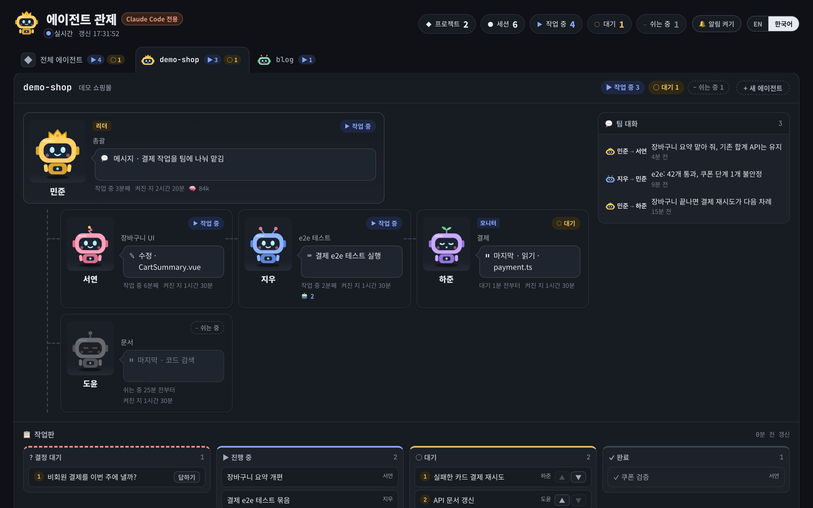

# claude-agent-monitor

[English](README.md) | **한국어**

이 컴퓨터에서 돌아가는 모든 Claude Code 세션을 **프로젝트 → 리더 → 에이전트** 순으로 묶어 보여주는
로컬 대시보드입니다. 의존성이 없고(Node 18 이상), 읽기 전용이며, `127.0.0.1` 에서만 열립니다.



<sub>데모 데이터입니다. 프로젝트, 이름, 작업은 모두 지어낸 것입니다.</sub>

```bash
npm start            # http://127.0.0.1:4777  (포트는 PORT=… 로 바꿉니다)
```

[데스크톱 앱](#데스크톱-앱)으로 설치하면 터미널 없이 전용 창과 트레이로 씁니다.

화면은 기본이 영어입니다. 헤더의 **EN / 한국어** 버튼으로 바꾸면 브라우저가 기억하고,
`http://127.0.0.1:4777/?lang=ko` 로 열어도 됩니다.

헤더의 **ⓘ 정보** 에는 프로그램 설명, 버전, 만든 곳(이롭스튜디오), 소스 코드 주소, 문제를 알릴 곳, 라이선스(MIT, 전문 포함)가 나옵니다.

## 화면에 보이는 것

- **프로젝트마다 탭 하나.** 탭에는 리더 로봇과, 작업 중(▶)·대기(○)인 세션 수가 나옵니다.
  고른 탭은 URL(`#project-name`)과 브라우저에 남습니다. **탭을 끌어다 놓으면** 프로젝트 순서가 바뀝니다(탭에 초점을 두고
  **Ctrl + Shift + ← / →** 도 됩니다). 전체 에이전트 화면도 같은 순서를 따르고, 순서는 `config.json` 의 `order` 에 저장됩니다.
- **조직도.** 리더(왕관 쓴 로봇)가 맨 위에, 나머지 에이전트가 그 아래에 달립니다.
  카드마다 세션이 지금 하는 일을 말풍선으로, 그 상태로 얼마나 있었는지, 켜진 지 얼마나 됐는지를 보여줍니다.
- **이름.** 에이전트마다 사람 이름이 붙습니다. 영어로는 Tom, Mark, …, 한국어로는 민준, 서연, … 입니다.
  그래서 `-7f` 와 `-74` 를 헷갈리지 않습니다. 이름은 세션 id 에서 만들기 때문에 어느 브라우저에서 봐도,
  몇 번을 새로 불러와도 같고, 한 프로젝트 안에서 겹치지 않습니다. `config.json` 의 `names` 로 이름을 고정할 수 있습니다.
- **작업판** (선택). 프로젝트의 진행 중인 작업, 대기 중인 작업(번호순), 끝난 작업, 사람이 결정해야 할 일.
- **팀 대화.** 누가 누구에게 메시지를 보냈는지 한 줄 요약으로 보여줍니다.
- **서브에이전트.** 서브에이전트(Agent 도구)가 돌고 있으면 카드에 `🤖 2` 처럼 그 수가 나옵니다.
  에이전트 창의 **서브에이전트** 탭에는 최근 서브에이전트가 종류, 목적, 마지막 동작, 도구 호출 수와 함께 나오고,
  하나를 고르면 그 대화를 실시간으로 따라갑니다(본 대화와 같은 방식으로 가립니다).

화면은 3초마다 새로 불러옵니다(탭이 가려져 있으면 15초마다).

## 읽는 것

| 출처 | 쓰는 곳 |
|---|---|
| `~/.claude/sessions/<pid>.json` | 세션 이름, 작업 폴더, 작업 중/대기, 시작 시각. 프로세스가 사라진 항목은 버립니다 |
| `~/.claude/projects/*/<sessionId>.jsonl` | **끝부분 768 KB 만** 읽습니다. 가장 최근 도구 동작과, 다른 세션에 보낸 메시지의 요약 줄 |
| 같은 기록과 서브에이전트 기록 | 하루에 한 번 처음부터 읽고 그 뒤로는 덧붙은 부분만 읽습니다. “오늘 쓴 토큰”을 위해 **답변의 토큰 수만** 가져옵니다 |
| `boards/<project>.json` | 작업판과 세션별 역할. 프로젝트 리더가 씁니다. 선택 사항 |
| `config.json` | 프로젝트 표시 이름, 리더 지정, 탭 순서. 선택 사항(`config.example.json` 참고) |
| `~/.claude.json` | 로그인한 계정(이름, 이메일, 조직)과 Claude Code가 마지막으로 저장한 사용량. 계정 창이 열려 있을 때만 |
| `~/.claude/.credentials.json` | Anthropic 에 사용량을 묻기 위한 Claude 로그인 토큰과 요금제. 계정 창이 열려 있을 때만 |

프로젝트는 세션 작업 폴더 위쪽의 git 루트 폴더 이름입니다. 리더는 `config.json` 에 적힌 세션이고,
적혀 있지 않으면 메시지를 가장 많이 보낸 세션(3개 이상)입니다.

## 절대 읽지 않는 것, 그리고 보여주는 것

- `~/.claude/sessions/*.key` 와 설정 파일은 열지 않습니다. `.credentials.json` 은 아래 계정 창에서만 엽니다.
  그 토큰은 `api.anthropic.com` 에만 보내고, 저장하거나 로그에 남기지 않습니다.
- 카드, 탭, 작업판, 상태 API 에는 사용자 프롬프트, 대화 내용, 도구 결과, 메시지 본문이 실리지 않습니다.
  도구 동작은 종류와 짧은 이름표(파일 이름이나 명령에 붙은 설명)로만 줄이고,
  웹 조회는 URL 도 검색어도 보여주지 않습니다. 소켓 주소는 화면까지 가지 않습니다.
- 예외는 에이전트 창의 **대화 보기** 하나입니다. VS Code 패널처럼 그 세션의 기록을 실시간으로 따라갑니다.
  창이 열려 있는 동안에만 보내고, 페이지 토큰이 있어야 하며, 저장하거나 로그에 남기지 않습니다.
  내보낼 때 가립니다. 이메일 주소, 전화번호, 주민등록번호, 카드 번호, 그리고 키·토큰·비밀번호처럼 보이는 것은
  `[email]`, `[secret]` 등으로 바뀝니다. 긴 영문·숫자 나열(커밋 해시 전체 같은 것)도 가립니다.
- `Host` 가 `127.0.0.1`, `localhost`, `[::1]` 이 아닌 요청은 거부합니다(421).
  그래서 다른 웹 페이지가 자기 도메인을 이 컴퓨터로 돌려 API 에 닿는 일(DNS rebinding)은 막힙니다.

## 상태

| 표시 | 뜻 |
|---|---|
| ▶ 작업 중 | 세션이 일하는 중입니다. 로봇이 타자를 칩니다 |
| ○ 대기 | 쉰 지 30분이 안 됐습니다. 로봇이 꾸벅꾸벅 좁니다 |
| – 쉬는 중 | 30분 넘게 쉬고 있습니다. 로봇이 회색이 됩니다 |
| ! 승인 대기 | 승인이나 질문이 답을 기다립니다(여기서든 VS Code 에서든). 로봇이 조는 대신 눈을 크게 뜨고 통통 뛰며, 머리 위에 `z` 대신 주황색 **!** 가 뜹니다. 카드 테두리도 깜빡입니다 |

상태를 색만으로 구분하지 않습니다. 상태마다 기호, 글자, 표정, 움직임이 따로 있습니다.

## 화면에서 승인하기 (선택)

권한 요청을 VS Code 대신 모니터에서 답할 수 있습니다. Claude Code 가 `PermissionRequest` 마다
`hooks/bridge.mjs` 를 실행하고, 요청은 물어본 에이전트 이름과 함께 화면 맨 위에 나옵니다.

- **도구 요청**: 허용, "항상 허용: …"(VS Code 와 같은 선택지), 거부, 거부하고 멈추기.
- **질문**(`AskUserQuestion`): 선택지를 고르거나 직접 답을 적어서 보냅니다.
- **계획**(`ExitPlanMode`): 계획 승인 또는 계속 계획하기.
- **VS Code에서 답하기**를 누르면 어느 것이든 원래 요청 창으로 돌려보냅니다.
- **단축키**: 맨 앞 요청의 버튼마다 번호가 붙고, 그 숫자를 누르면 됩니다(메시지 입력 중에는 Alt+숫자).
  질문에서는 숫자로 선택지를 고르고, ↑↓로 질문을 옮기고, Enter로 보냅니다.

같은 훅이 `PostToolUse` 와 `Stop` 에서 세션마다 권한 모드(MANUAL, AUTO, …)를 화면에 알려줍니다.

`~/.claude/settings.json` 에 아래를 넣습니다(이미 있는 `hooks` 와 합칩니다).

```json
"hooks": {
  "PermissionRequest": [{ "matcher": "*", "hooks": [{ "type": "command", "command": "node \"C:/dev/claude-agent-monitor/hooks/bridge.mjs\"", "timeout": 90 }] }],
  "PostToolUse": [{ "matcher": "*", "hooks": [{ "type": "command", "command": "node \"C:/dev/claude-agent-monitor/hooks/bridge.mjs\"", "async": true, "timeout": 10 }] }],
  "Stop": [{ "hooks": [{ "type": "command", "command": "node \"C:/dev/claude-agent-monitor/hooks/bridge.mjs\"", "async": true, "timeout": 10 }] }]
}
```

- 누군가 화면을 보고 있을 때만 동작합니다. 보이는 화면이 없거나 모니터가 꺼져 있으면
  훅은 아무 답도 하지 않고, 평소의 VS Code 요청 창이 바로 뜹니다.
- 60초 동안 아무도 답하지 않으면 요청은 VS Code 로 돌아갑니다.
- 답하려면 서버가 켤 때마다 새로 만드는 토큰이 필요합니다(화면 안에, 그리고 훅용으로 `.runtime/bridge.json` 에 있습니다).
  다른 웹 페이지는 이 토큰을 읽을 수 없으니 아무것도 승인할 수 없습니다.
- 대기 중인 요청은 메모리에만 있습니다. 판단할 수 있게 명령이나 파일 경로를 화면에 보여주지만,
  디스크에 쓰거나 로그에 남기지 않습니다.

## Claude 계정

맨 위의 **👤 계정**을 누르면 이 PC의 Claude Code가 어떤 계정으로 로그인돼 있는지, 요금제, 한도를 얼마나 썼는지
(현재 5시간 세션과 주간, 각각 언제 초기화되는지) 보여 줍니다. 숫자는 Claude Code의 `/usage` 와 같은 곳에서 가져오고,
창이 열려 있는 동안 1분에 한 번까지만 묻습니다. Anthropic 에 닿지 못하면 Claude Code가 마지막으로 저장해 둔 값을
그렇다고 표시해서 보여 줍니다.

- **계정 바꾸기**: 로그아웃한 뒤 `claude auth login` 을 새 창으로 엽니다. 브라우저에서 로그인을 마치면 됩니다.
- **로그아웃**: `claude auth logout` 을 실행합니다. 다시 로그인할 때까지 이 PC의 모든 Claude Code 세션
  (VS Code, 모니터 에이전트)이 멈춥니다.

로그인 정보는 Claude Code가 직접 관리합니다. 모니터는 계정, 이메일, 토큰을 따로 저장하지 않습니다.

데스크톱 앱에서는 같은 숫자가 제목 줄(**세션 45% · 주간 29%**, 누르면 이 창이 열림)과 트레이 툴팁에도 나옵니다. 80%를 넘으면 노란색, 95%를 넘으면 빨간색이고, 한도마다 80%와
95%를 넘을 때 한 번씩 데스크톱 알림을 보냅니다(초기화될 때까지 다시 알리지 않음). 카드마다 그 세션과 서브에이전트가 오늘
쓴 토큰이 나오고(**⚡ 11M**, 자세한 내역은 마우스를 올리거나 상세 창에서), 계정 창에는 오늘 토큰을 많이 쓴 에이전트가 나옵니다.

작업 중인데 10분 동안 아무 활동이 없는 에이전트는 **멈춘 듯** 으로 표시하고 한 번 알립니다. 모니터가 띄운 에이전트는 상세 창의
**멈추고 이어서 하기** 로 지금 턴을 멈추고 같은 세션에 이어서 하라고 보냅니다. VS Code 세션은 그 패널에서 Esc 로 멈춰야 합니다.

## 모니터가 직접 띄우는 에이전트

**+ 새 에이전트**(프로젝트 헤더나 전체 에이전트 탭에 있습니다)는 VS Code 없이 에이전트를 시작합니다.
VS Code 확장이 하는 방식과 같습니다. 모니터가 설치된 `claude` 프로그램을 헤드리스 모드
(`claude -p --input-format stream-json --output-format stream-json --include-partial-messages`)로,
고른 폴더에서, 내 Claude Code 로그인으로 실행합니다. 카드에는 **모니터** 표시가 붙고, 창의 대화 탭이 곧 전체 채팅입니다.

- 창의 **이름**과 **모습**은 골라도 되고 비워 둬도 됩니다. 이름을 비워 두면 자동으로 붙습니다.
  모습은 색 8가지와 머리 장식(안테나, 쌍안테나, 헤드폰, 새싹, 번개) 가운데 고르고, 고르는 대로 미리보기가 바뀝니다.
  왕관은 고를 수 없습니다. 리더 표시이기 때문이고, 모니터 에이전트가 리더가 되면 자기 색 그대로 왕관을 씁니다.
- 답은 쓰이는 대로 흘러 들어오고, 도구 호출을 펼치면 입력과 결과가 보입니다.
- 권한 요청과 질문은 `hooks/permission-mcp.mjs`(`--permission-prompt-tool`)를 거쳐 대화 안으로 들어와
  답을 기다립니다. 돌아갈 VS Code 가 없기 때문입니다.
- **중단**은 지금 턴을 끝냅니다(프로세스를 끝내고, 다음 메시지에서 `--resume` 으로 같은 세션을 이어갑니다).
  권한 모드와 모델 변경도 같은 방식으로 다음 메시지부터 적용됩니다.
- 첨부한 이미지는 이미지로, 다른 파일은 경로로 메시지에 들어갑니다.
- **에이전트 종료**는 에이전트를 멈추고 화면에서 뺍니다. 대화 기록은 `~/.claude/projects` 에 남습니다.

이 에이전트 목록은 서버를 다시 켜도 남습니다. `.runtime/agents.json` 에 에이전트마다 누구인지(폴더, 이름, 모습,
권한 모드, 모델, 세션 id)만 적고, 대화 내용은 적지 않습니다. 서버가 다시 켜지면 에이전트는 멈춘 상태로 돌아오고,
지금까지의 대화는 기록(transcript)에서 다시 읽어 옵니다. 다음 메시지를 보내면 같은 세션을 이어 갑니다. 모니터가 꺼질 때
(종료, 오류, 앱 업데이트) 한창 일하던 에이전트는 스스로 이어 갑니다. 모니터가 다시 켜졌다는 말과 함께 하던 곳부터 이어서 하라는 메시지를 받습니다.
**에이전트 종료**를 누르면 이 목록에서도 빠집니다.

`claude` 가 켜지는 동안 첫 답은 조금 늦게 옵니다. 프로그램을 찾지 못하면 `config.json` 에 `"claudePath"` 를 적습니다.

## 데스크톱 앱

`desktop/` 은 모니터를 윈도우 앱으로 묶습니다. 터미널이 필요 없고, VS Code 를 닫아도 영향을 받지 않습니다.

**설치.** `Agent Monitor Setup <버전>.exe` 를 실행합니다(아래 `npm run dist` 로 만듭니다). 지금 사용자 계정에만 설치되어
관리자 권한이 필요 없고, 설치가 끝나면 바로 켜집니다. 코드 서명이 없어서 윈도우가 경고할 수 있습니다: *추가 정보 → 실행*.

**처음 켤 때.** Claude Code 설정에 모니터 hook 이 없으면 앱이 설치할지 묻습니다(`~/.claude/settings.json` 에서 모니터 항목만
추가하거나 바꾸고, 원래 파일은 `settings.json.before-agent-monitor` 로 남깁니다). Node.js 가 있으면 hook 이 Node.js 로,
없으면 앱 자체로 돌아갑니다. 그래서 새 PC 에 필요한 건 **Claude Code**(설치와 로그인) 뿐입니다.

**창.**
- 윈도우 기본 제목 표시줄이 없습니다. 창 버튼과 같은 줄의 얇은 제목 줄에 **← → ⟳**, **− 100% +**, **⚙ 설정** 이 있고,
  이 줄을 잡고 끌면 창이 움직입니다. 확대/축소(버튼, **Ctrl + 휠**, **Ctrl + − / 0 / =**)는 페이지에만 적용되어 제목 줄은
  그대로이고, 비율은 기억합니다. **Alt + ← / →**, **F5** 도 됩니다. 프로젝트 탭을 옮기면 기록이 남아 뒤로/앞으로로 오갑니다.
- 창을 닫으면 트레이로 숨고 에이전트는 계속 돕니다(설정에서 끄면 창을 닫을 때 종료).
- **기다리는 요청이 있으면:** 작업표시줄 버튼과 트레이 아이콘에 주황 점이 붙고, 트레이 툴팁에 건수가 나옵니다. 새 요청이 오면
  창이 앞에 없을 때 작업표시줄이 깜빡이고 데스크톱 알림이 뜹니다. 멈춘 듯한 에이전트, 80%·95%를 넘은 한도도 알립니다.
  알림을 누르면 창이 열립니다.
- **어디서든 부르는 단축키**(기본 **Ctrl + Alt + J**): 창을 띄우고 키 입력을 페이지로 보내므로 숫자 키로 맨 앞 요청에 바로 답할
  수 있습니다. 한 번 더 누르면 숨깁니다. 다른 프로그램이 쓰는 키면 비어 있는 다음 키를 쓰고, 설정에서 바꿀 수 있습니다.
- **업데이트:** 설치한 앱은 켤 때와 6시간마다 GitHub Releases 를 확인하고, 새 버전을 뒤에서 받아 두었다가 다음에 다시 켤 때
  설치합니다. 트레이나 설정에서 바로 설치할 수도 있습니다.

**설정**(제목 줄의 ⚙ 이나 트레이): 로그인할 때 자동 시작 · 창을 닫으면 트레이로 · 창 불러오기 단축키 · 데이터 폴더(열기, 바꾸기) ·
Claude Code hook(상태, 설치/갱신) · 업데이트(확인, 설치) · 버전, 프로그램 정보, 브라우저에서 열기.

**트레이:** 열기 · 설정 · 프로그램 정보 · 종료(종료하면 모니터 에이전트도 멈춥니다).

- 모니터 서버는 앱 안에서 돕니다. 이미 그 포트에서 모니터가 돌고 있으면(터미널의 `npm start` 등) 새로 띄우지 않고 그쪽을 보여 줍니다.
- 데이터 폴더(`config.json`, `boards/`, `.runtime/`)의 기본 위치는 `~/.claude-agent-monitor` 입니다. 리더가 작업판을 쓰는
  폴더로 바꿔 두세요. `npm start` 에서는 `MONITOR_HOME` 이 같은 역할을 합니다.
- hook 은 `~/.claude-agent-monitor/bridge.json` 으로 돌고 있는 모니터를 찾으므로, 모니터가 어디서 돌든 연결됩니다.

직접 빌드하기:

```bash
cd desktop
npm install          # 앱에만 필요한 Electron 과 electron-builder — 모니터 본체는 계속 의존성이 없습니다
npm start            # 소스에서 바로 실행
npm run dist         # dist/Agent Monitor Setup <버전>.exe
```

설치된 앱들이 받아 가는 새 버전을 내려면: `desktop/package.json` 의 `version` 을 올린 뒤
`GH_TOKEN=<릴리스를 쓸 수 있는 토큰> npm run release` 를 실행합니다. 설치 파일을 만들어 `latest.yml` 과 함께 그 버전의 GitHub
릴리스에 올리고, 앱들은 6시간 안에(설정의 **지금 확인** 이면 바로) 찾아냅니다.

## 작업판 형식

`boards/example.json` 을 봅니다.

- `status` 는 `running | queued | blocked | done` 중 하나이고, `order` 가 대기 순서를 정합니다.
- `roles` 는 세션과 짧은 역할을 짝짓습니다. 예: `{ "-0f": "auth · simulation" }`.
- `session` 과 `roles` 의 키에는 짧은 이름(`-0f`), 전체 세션 이름, 별명(`Tom`, `민준`)을 쓸 수 있습니다.
- `boards/*.json` 과 `config.json` 은 로컬 상태라 커밋하지 않습니다.

## 만든 곳: 이롭스튜디오

<a href="https://elopstudio.com">
  <picture>
    <source media="(prefers-color-scheme: dark)" srcset="docs/elop-logo-white.png">
    
  </picture>
</a>

[이롭스튜디오(ELOP Studio)](https://elopstudio.com)가 만들고 관리합니다.

## 라이선스

[MIT](LICENSE)
