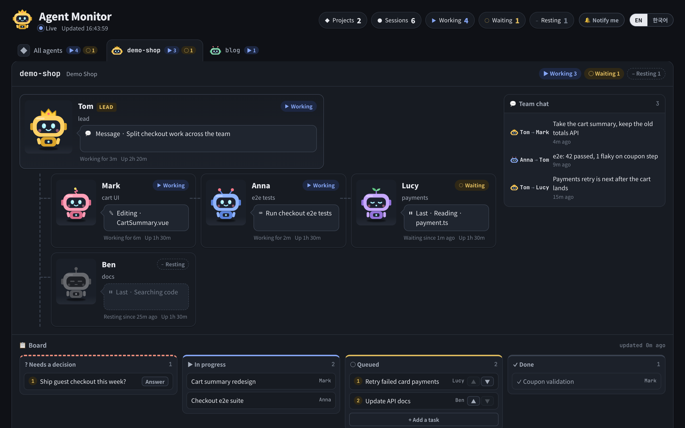

# claude-agent-monitor

**English** | [한국어](README.ko.md)

A local dashboard for every Claude Code session running on this machine, grouped as
**project → leader → agents**. No dependencies (Node 18+), read-only, listens on `127.0.0.1` only.



<sub>Demo data: the project, names and tasks are made up.</sub>

```bash
npm start            # http://127.0.0.1:4777  (override with PORT=…)
```

Or install the [desktop app](#desktop-app): a window of its own and the tray, no terminal needed.

The page is in English by default. Switch to Korean with the **EN / 한국어** toggle in the header
(remembered in the browser) or open `http://127.0.0.1:4777/?lang=ko`.

## What you see

- **One tab per project.** Each tab shows the leader's robot and how many sessions are working (▶) or waiting (○).
  The selected tab is kept in the URL (`#project-name`) and in the browser.
- **Org chart.** The leader (crowned robot) sits on top; the other agents hang below it.
  Each card shows the session's current action in a speech bubble, how long it has been in its state, and its uptime.
- **Names.** Every agent also gets a person's name — Tom, Mark, … in English, 민준, 서연, … in Korean — so
  `-7f` and `-74` are easy to tell apart. The name is derived from the session id, so it is the same in every
  browser and on every poll, and no two agents in one project share one. Pin a name with `names` in `config.json`.
- **Board** (optional). The project's tasks in progress, queued (numbered), done, and decisions waiting on a human.
- **Team chat.** Who messaged whom, as one-line summaries.
- **Subagents.** A card shows `🤖 2` while that many of its subagents (the Agent tool) are running; the agent's dialog has a
  **Subagents** tab listing the recent ones — kind, purpose, last action, tool calls — and opens any of them as its own
  live conversation (masked like the main one).

The page polls every 3 seconds (every 15 seconds while the tab is hidden).

## What it reads

| Source | Used for |
|---|---|
| `~/.claude/sessions/<pid>.json` | Session name, working directory, busy/idle, start time. Entries whose process is gone are dropped |
| `~/.claude/projects/*/<sessionId>.jsonl` | **Only the last 768 KB** — the latest tool action and the summary line of messages sent to other sessions |
| `boards/<project>.json` | The task board and per-session roles, written by the project's leader — optional |
| `config.json` | Project labels, leader assignment, tab order — optional (see `config.example.json`) |

A project is the folder name of the git root above a session's working directory. The leader is the session
named in `config.json`; without one, it is the session that sent the most messages (at least 3).

## What it never reads, and what it shows

- `~/.claude/sessions/*.key`, `.credentials.json` and settings files are never opened.
- The cards, tabs, board and state API carry no user prompts, conversation text, tool results or message bodies:
  a tool action is reduced to its kind plus a short label (a file name or the command's own description), and
  web lookups show neither the URL nor the query. Socket addresses never reach the page.
- The one exception is the **conversation view** in an agent's detail dialog, which follows that session's
  transcript live, like the VS Code panel. It is streamed only while the dialog is open, needs the page's token,
  is never stored or logged, and is masked on the way out: e-mail addresses, phone numbers, resident registration
  and card numbers, and anything that looks like a key, token or password become `[email]`, `[secret]` and so on.
  Long letter-and-digit runs (a full commit hash, say) are masked too.
- Requests whose `Host` is not `127.0.0.1`, `localhost` or `[::1]` are refused (421), so a web page cannot
  reach the API by pointing its own domain at this machine (DNS rebinding).

## States

| Shown as | Meaning |
|---|---|
| ▶ Working | The session is busy — the robot is typing |
| ○ Waiting | Idle for less than 30 minutes — the robot is dozing |
| – Resting | Idle for 30 minutes or more — the robot is greyed out |

State is never carried by colour alone: every state also has a symbol, a word, a face and a motion.

## Approvals from the page (optional)

Permission prompts can be answered from the monitor instead of VS Code. Claude Code runs `hooks/bridge.mjs`
on every `PermissionRequest`; the request shows up at the top of the page, naming the agent that asked:

- **Tool prompts** — Allow, "Always allow: …" (the same choices VS Code offers), Deny, Deny and stop.
- **Questions** (`AskUserQuestion`) — pick the options or type your own answer, then send.
- **Plans** (`ExitPlanMode`) — Approve plan or Keep planning.
- **Answer in VS Code** hands any of them back to the normal prompt.
The same hook, on `PostToolUse` and `Stop`, tells the page each session's permission mode (MANUAL, AUTO, …).

Add this to `~/.claude/settings.json` (merge with any `hooks` you already have):

```json
"hooks": {
  "PermissionRequest": [{ "matcher": "*", "hooks": [{ "type": "command", "command": "node \"C:/dev/claude-agent-monitor/hooks/bridge.mjs\"", "timeout": 90 }] }],
  "PostToolUse": [{ "matcher": "*", "hooks": [{ "type": "command", "command": "node \"C:/dev/claude-agent-monitor/hooks/bridge.mjs\"", "async": true, "timeout": 10 }] }],
  "Stop": [{ "hooks": [{ "type": "command", "command": "node \"C:/dev/claude-agent-monitor/hooks/bridge.mjs\"", "async": true, "timeout": 10 }] }]
}
```

- Nothing changes unless someone is looking at the page: with no visible page, or with the monitor not running,
  the hook answers nothing and the normal VS Code prompt appears right away.
- A request nobody answers goes back to VS Code after 60 seconds.
- Answers need a token the server creates at every start (in the page, and in `.runtime/bridge.json` for the hook).
  Another web page cannot read it, so it cannot approve anything.
- Pending requests live in memory only. The command or file path is shown on the page so you can judge it,
  and is never written to disk or logged.

## Agents the monitor runs itself

**+ New agent** (in a project's header, or on the all-agents tab) starts an agent without VS Code, the way the
VS Code extension does it: the monitor runs the installed `claude` program in headless mode
(`claude -p --input-format stream-json --output-format stream-json --include-partial-messages`) in the folder you pick,
on your own Claude Code login. Its card is marked **MONITOR**; its dialog's conversation tab is the full chat:

- **Name** and **Look** in the dialog are optional. Leave the name empty for an automatic one. The look is one of eight
  colours and a headgear (antenna, twin, headphones, sprout, bolt), with a live preview. The crown is not on offer:
  it marks the leader, and a monitor agent that becomes the leader wears it in its own colour;
- replies stream in as they are written; tool calls open to show input and result;
- permission prompts and questions arrive in the conversation through `hooks/permission-mcp.mjs`
  (`--permission-prompt-tool`) and wait for your answer — there is no VS Code to fall back to;
- **Stop** ends the current turn (the process is ended; the next message resumes the same session with `--resume`);
  permission mode and model changes apply from the next message the same way;
- attached images go into the message as images; other files by path;
- **End agent** stops it and removes it from the page; its transcript stays in `~/.claude/projects`.

The list of these agents survives a restart. `.runtime/agents.json` keeps who each one is (folder, name, look,
permission mode, model, session id) and never what was said. When the server starts again they come back stopped,
their conversation read back from the transcript, and the next message resumes the same session.
**End agent** also removes it from that list.

`claude` takes a while to start, so the monitor starts it as soon as an agent is created, and when the dialog of a
stopped agent is opened — by the time the first message is written it is ready. **Quick start** leaves out your MCP
servers and connectors, which starts faster still. Set `"claudePath"` in `config.json` if the program is not found.

## Desktop app

`desktop/` packages the monitor as a Windows app: no terminal, and nothing depends on VS Code staying open.

**Install.** Run `Agent Monitor Setup <version>.exe` (build it with `npm run dist`, below). It installs for the current
user — no admin rights — and starts. The installer is not code-signed, so Windows SmartScreen may warn: *More info → Run anyway*.

**First run.** If Claude Code's settings do not have the monitor's hooks yet, the app offers to add them
(`~/.claude/settings.json`; only the monitor's entries are added or replaced, a backup is kept as
`settings.json.before-agent-monitor`). With Node.js on the PATH the hooks run on it; without, they run on the app
itself. So a new PC needs only **Claude Code**, installed and signed in.

**The window.**
- No Windows title bar. A thin title strip on the window buttons' line holds **← → ⟳**, **− 100% +** and **⚙ settings**;
  drag it to move the window. Zooming (buttons, **Ctrl + wheel**, **Ctrl + − / 0 / =**) scales the page only — the strip
  stays put — and is remembered. **Alt + ← / →** and **F5** work too; project tabs are history entries.
- Closing the window keeps the monitor in the tray, with its agents running (or quits, if you turn that off).

**Settings** (⚙ in the strip, or the tray): start at login · close to the tray · the data folder (open or change it) ·
the Claude Code hooks (state, install / update) · version, and open the page in the browser.

**Tray:** open · settings · quit (quitting also stops the monitor agents).

- The server runs inside the app. If a monitor is already answering on the port (`npm start` in a terminal), the app
  shows that one instead of starting another.
- The data folder (`config.json`, `boards/`, `.runtime/`) defaults to `~/.claude-agent-monitor`; point it at the folder
  your leaders write their boards to. `MONITOR_HOME` does the same for `npm start`.
- The hooks find the running monitor through `~/.claude-agent-monitor/bridge.json`, wherever it runs from.

Build it yourself:

```bash
cd desktop
npm install          # Electron and electron-builder, only for the app — the monitor itself stays dependency-free
npm start            # run it from source
npm run dist         # dist/Agent Monitor Setup <version>.exe
```

## Board format

See `boards/example.json`.

- `status` is one of `running | queued | blocked | done`; `order` sets the queue position.
- `roles` maps a session to a short role, e.g. `{ "-0f": "auth · simulation" }`.
- `session` and the keys of `roles` may be a short name (`-0f`), a full session name or a nickname (`Tom`, `민준`).
- `boards/*.json` and `config.json` are local state and are not committed.

## Made by ELOP Studio

<a href="https://elopstudio.com">
  <picture>
    <source media="(prefers-color-scheme: dark)" srcset="docs/elop-logo-white.png">
    
  </picture>
</a>

Built and maintained by [ELOP Studio](https://elopstudio.com) (이롭스튜디오).

## License

[MIT](LICENSE)
